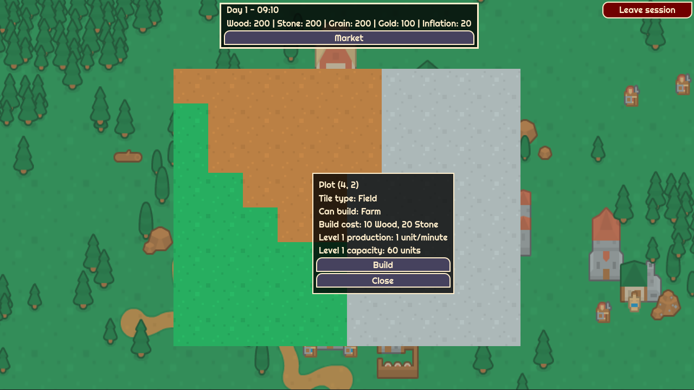
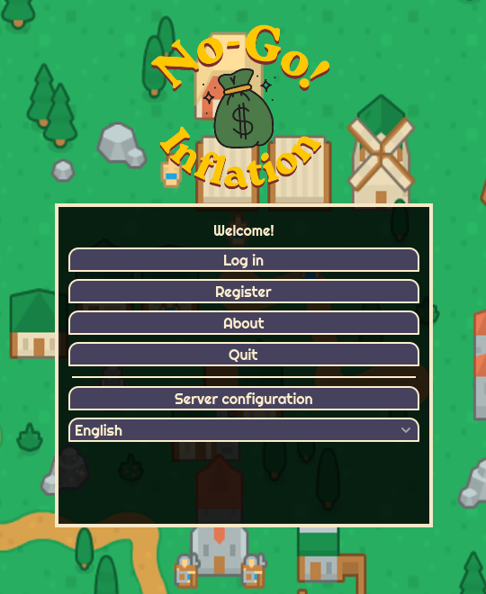
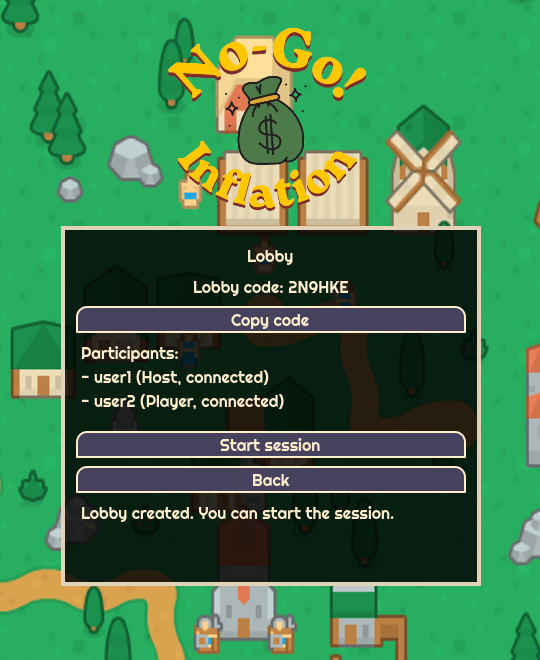
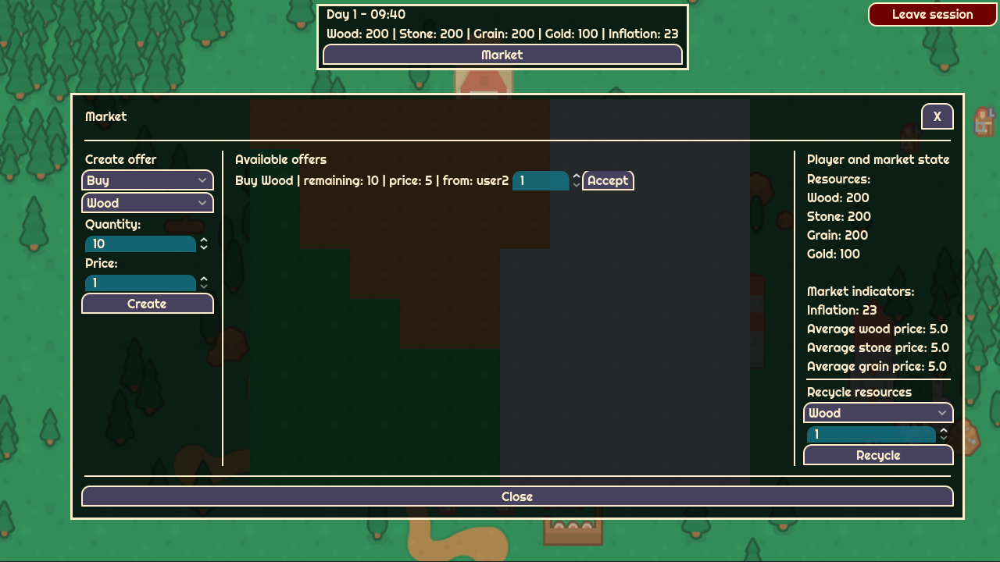

# No-go Inflation

[](https://github.com/RipplyPear/2d-collaborative-game/actions/workflows/server-ci.yaml)

> A cooperative multiplayer economic strategy game built as a client-server application.

No-go Inflation is a 2D multiplayer game in which players build local economies, collect resources, trade through a shared market, and try to grow without destabilizing the session economy through excessive inflation.

Built as my Bachelor's degree project at the Bucharest University of Economic Studies (ASE).



## Highlights

- Real-time multiplayer gameplay through WebSockets
- Authoritative Node.js server that validates all game actions
- Lobby creation and joining via a shareable code
- Individual maps generated for each player
- Resource production, collection, building upgrades, and recycling
- Shared market for player-to-player buy and sell offers
- Inflation, average prices, economic score, rankings, and end-of-session results
- JWT authentication via REST
- Local-network support: clients can select the server's IPv4 address from the game menu

## Gameplay

Players receive their own map containing fields, forests, and quarries.

- Build farms, lumber mills, and mines on the appropriate terrain.
- Collect wood, stone, and grain produced over time.
- Spend resources to build and upgrade production buildings.
- Trade resources with other players through the shared market.
- Recycle resources for gold, affecting the session's inflation.
- At the end of the session, the server calculates individual scores and the collective economic outcome.

## Screenshots

| Start menu | Multiplayer lobby |
| --- | --- |
|  |  |




## Architecture

The application follows an authoritative client-server design:

- **Godot client**: UI, player input, and rendering of server state.
- **Node.js / TypeScript server**: authentication, lobby management, game rules, economy calculations, and WebSocket communication.
- **PostgreSQL**: persistent users, sessions, maps, resources, buildings, market offers, trades, and results.


## Tech stack

| Area | Technologies |
| --- | --- |
| Client | Godot 4, GDScript, `HTTPRequest`, `WebSocketPeer` |
| Server | Node.js, TypeScript, Express, `ws` |
| Database | PostgreSQL, `pg`, SQL migrations |
| Security and validation | JWT, bcrypt, Zod |
| Tooling | npm, dotenv, draw\.io |

## Run locally

### Prerequisites

- Node.js and npm
- PostgreSQL
- Godot 4.x

### 1. Configure the database

```bash
createdb no_go_inflation

cd server
psql -U postgres -d no_go_inflation -f db/migrations/01_users.sql
psql -U postgres -d no_go_inflation -f db/migrations/02_game_state_tables.sql
```

### 2. Configure and start the server

Copy the example configuration, then replace the placeholder database password and JWT secret:

```bash
cp server/.env.example server/.env
```

Then start the server:

```
cd server
npm install
npm run dev
```

### 3. Start the Godot client

Open `client/no-go-inflation` in Godot and run the project.

By default, the client connects to `localhost`. To play on the same local network, enter the IPv4 address printed by the server in Server Configuration - for example, `192.168.1.144` - then verify and save it.

## Verify the server

```bash
cd server
npm run format:check
npm run lint
npm test
npm run build
```

The same checks run in GitHub Actions for pull requests targeting `main`.

## Documentation

- [Technical overview](./documentation/technical-overview.md)
- [Academic documentation hub (Romanian)](./documentation/academic/README-ro.md)
- [Database migrations](./server/db/migrations/)

### Development notes

The game includes debug-only controls for local testing and demonstrations. They are available only in debug client builds and are rejected by the server when `NODE_ENV=production`.


## License

Copyright © 2026 Dragoș-Matei Mincinoiu

The source code is licensed under the [GNU General Public License v3.0](LICENSE).

Third-party assets and fonts are not covered by this license. Their respective license notices are included with the assets.

Third-party assets, themes, and fonts retain their own licenses; see [THIRD_PARTY_NOTICES.md](THIRD_PARTY_NOTICES.md).
