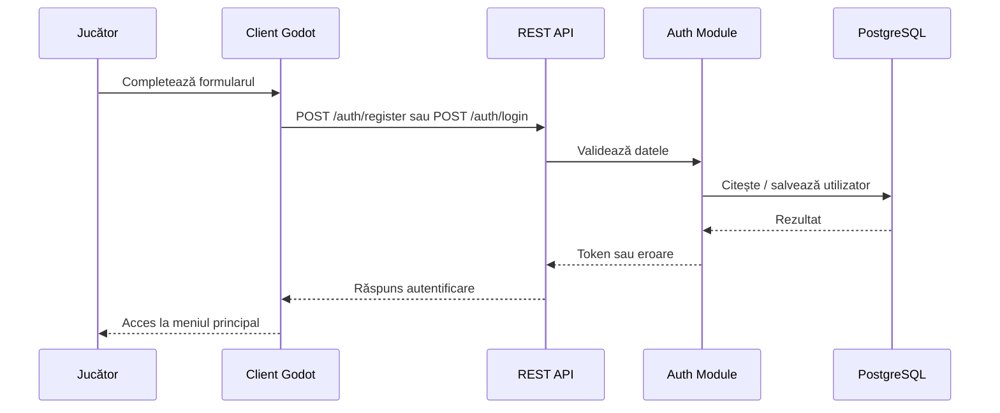
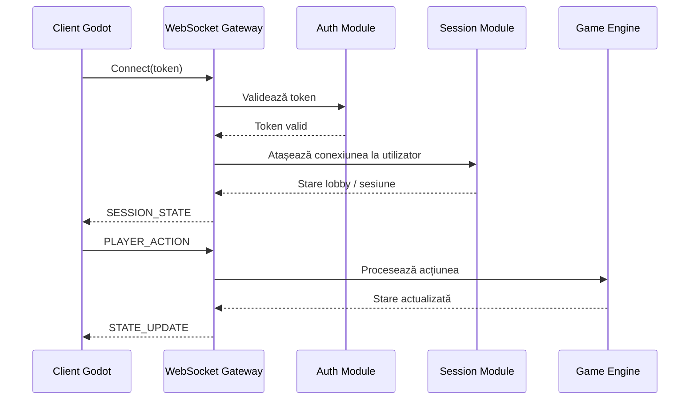
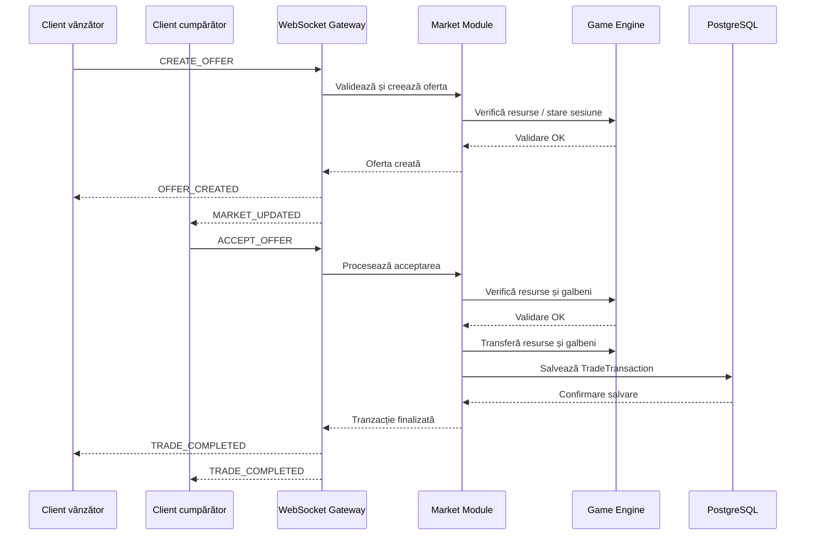
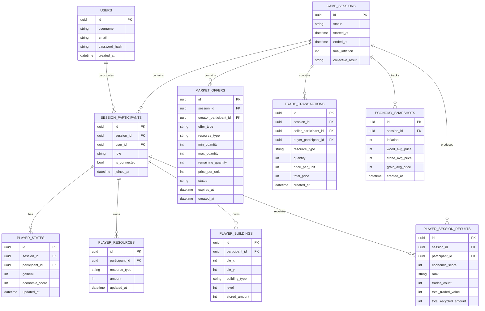
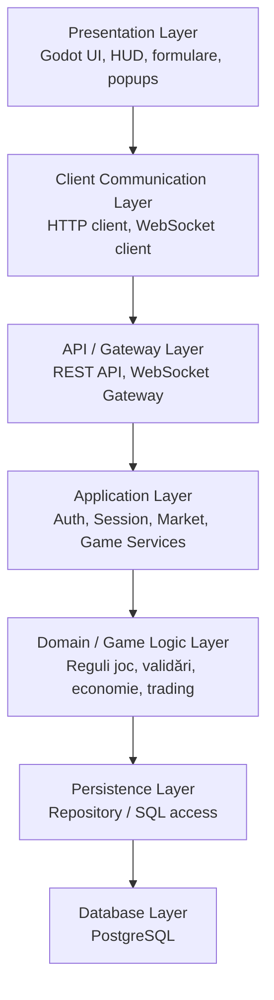
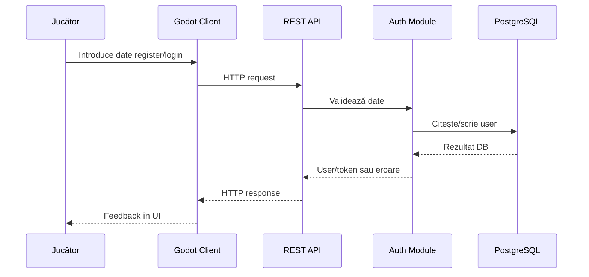
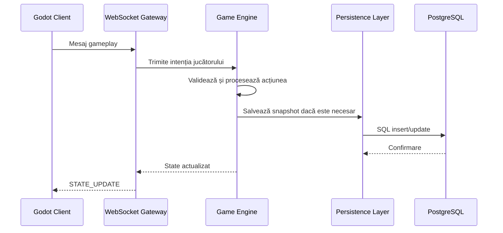
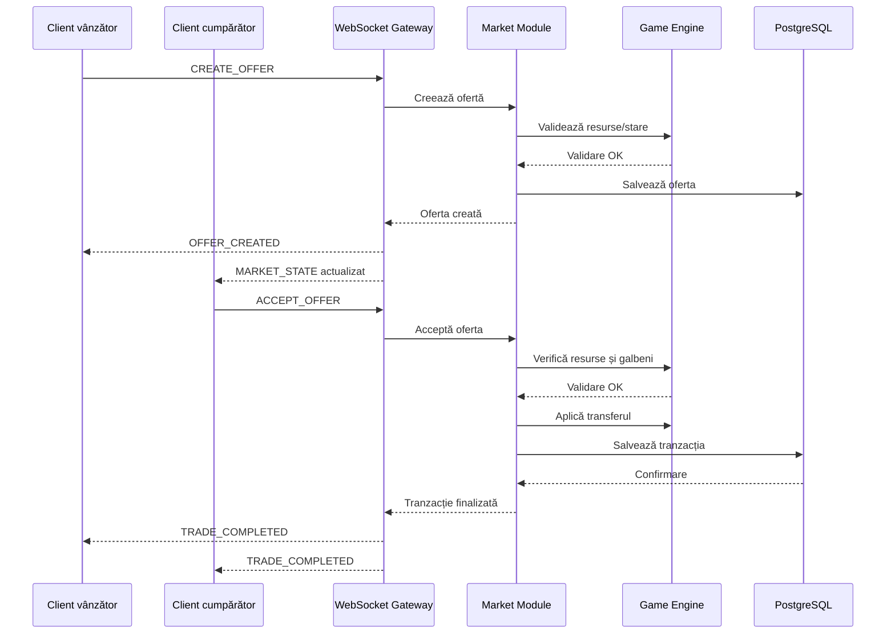

# Arhitectura sistemului

## 1. Scopul documentului

Acest document descrie arhitectura tehnică a aplicației **No-go Inflation**, cu accent pe relația dintre clientul Godot, serverul aplicației, comunicarea realtime și baza de date.

Documentul are rolul de a clarifica:

- componentele principale ale sistemului;
- responsabilitățile fiecărei componente;
- modul de comunicare dintre client și server;
- modul de persistare a datelor;
- structura generală a fluxurilor de autentificare, sesiune și tranzacționare;
- deciziile tehnice relevante pentru implementarea proiectului.

Arhitectura este gândită pentru un proiect de licență, deci urmărește claritate, stabilitate și demonstrabilitate, fără a introduce complexitate inutilă.

---

## 2. Vedere generală asupra sistemului

Sistemul este format din trei componente principale:

1. **Clientul de joc**, implementat în Godot;
2. **Serverul aplicației**, implementat în Node.js + TypeScript;
3. **Baza de date**, implementată în PostgreSQL.

Clientul este responsabil pentru interfață, input și afișarea stării jocului. Serverul este componenta autoritativă care validează acțiunile, procesează logica de joc și sincronizează participanții. Baza de date persistă informațiile importante, precum utilizatorii, sesiunile, participanții, tranzacțiile și rezultatele finale.

```mermaid
flowchart LR
    subgraph Client["Client Godot"]
        UI["UI / HUD"]
        Input["Input jucător"]
        LocalView["Afișare hartă, resurse și piață"]
        WSClient["WebSocket Client"]
        RESTClient["REST Client"]
    end

    subgraph Server["Server Node.js + TypeScript"]
        RESTAPI["REST API"]
        WSGateway["WebSocket Gateway"]
        Auth["Auth Module"]
        Session["Lobby & Session Module"]
        GameEngine["Game Engine"]
        Market["Market / Trading Module"]
        Economy["Economy & Inflation Module"]
        Persistence["Persistence Layer"]
    end

    subgraph Database["PostgreSQL"]
        Users["users"]
        Sessions["game_sessions"]
        State["state snapshots"]
        Trades["trade_transactions"]
        Results["player_session_results"]
    end

    UI --> Input
    Input --> RESTClient
    Input --> WSClient
    LocalView --> UI

    RESTClient <-->|register / login / bootstrap| RESTAPI
    WSClient <-->|gameplay realtime| WSGateway

    RESTAPI --> Auth
    RESTAPI --> Session

    WSGateway --> Session
    WSGateway --> GameEngine
    GameEngine --> Market
    GameEngine --> Economy

    Auth --> Persistence
    Session --> Persistence
    Market --> Persistence
    Economy --> Persistence
    Persistence --> Database
```



---

## 3. Principii arhitecturale

### 3.1 Server autoritativ

Serverul reprezintă singura sursă validă pentru starea jocului. Clientul nu modifică direct starea economică, resursele, clădirile sau piața. Clientul trimite doar intenții, iar serverul decide dacă acestea sunt valide.

Exemple de intenții trimise de client:

- construire clădire;
- upgrade clădire;
- colectare resurse;
- creare ofertă;
- acceptare ofertă;
- reciclare resurse;
- părăsire sesiune.

Serverul verifică regulile jocului, actualizează starea validă și trimite rezultatul către client.

### 3.2 Client subțire

Clientul Godot are rol de prezentare și interacțiune. El afișează harta, resursele, clădirile, piața și indicatorii economici, dar nu decide validitatea acțiunilor importante.

Clientul poate păstra temporar informații locale doar pentru interfață, animații sau feedback vizual. Starea relevantă de gameplay trebuie confirmată de server.

### 3.3 Backend modular

Serverul este implementat ca un **monolit modular**. Aplicația rulează ca un singur backend, dar codul este organizat pe module clare.

Această alegere evită complexitatea microserviciilor, dar păstrează separarea responsabilităților.

Modulele principale sunt:

- `auth` - înregistrare, autentificare, token-uri;
- `lobby/session` - lobby-uri, participanți, start sesiune;
- `websocket` - comunicare realtime;
- `game` - timp, hartă, clădiri, producție, state runtime;
- `market` - oferte, acceptări, tranzacții;
- `economy` - inflație, prețuri medii, indicatori;
- `persistence` - acces la baza de date.

### 3.4 Separarea între runtime state și date persistente

Starea activă a jocului este menținută în principal în memoria serverului, pentru a permite procesare rapidă și sincronizare realtime.

Baza de date nu salvează fiecare stare intermediară a jocului, dar păstrează datele importante pentru autentificare, audit, reconectare, istoric și rezultate finale.

Pentru cerința de salvare a state-ului jocului curent, sistemul poate păstra snapshot-uri minime ale stării active, fără a transforma baza de date în motorul principal al simulării.

---

## 4. Componentele sistemului

## 4.1 Client Godot

Clientul Godot este aplicația cu care interacționează jucătorul. Acesta conține ecranele de autentificare, meniul principal, lobby-ul, harta de joc, HUD-ul și interfața pieței.

Responsabilități principale:

- afișarea interfeței;
- captarea inputului de la jucător;
- trimiterea intențiilor către server;
- afișarea stării primite de la server;
- gestionarea feedback-ului vizual local;
- menținerea conexiunii WebSocket în timpul sesiunii.

Clientul comunică cu serverul în două moduri:

- prin REST pentru register/login;
- prin WebSocket pentru gameplay și trading.

---

## 4.2 REST API

REST API-ul este folosit pentru operații clasice, rare și bine delimitate.

Operații gestionate prin REST:

- înregistrare utilizator;
- autentificare utilizator;
- verificare token;
- obținerea unor date inițiale de bootstrap, dacă este necesar.

REST este potrivit pentru aceste fluxuri deoarece nu necesită comunicare continuă în timp real.

---

## 4.3 WebSocket Gateway

WebSocket Gateway-ul gestionează comunicarea realtime dintre client și server în timpul unei sesiuni de joc.

Prin WebSocket se transmit:

- acțiuni de gameplay;
- actualizări de state;
- mesaje legate de piață;
- actualizări de timp;
- notificări despre tranzacții;
- mesaje de eroare;
- resincronizări după reconectare.

WebSocket-ul este canalul principal pentru gameplay deoarece acțiunile jucătorilor și schimbările economice trebuie propagate rapid către participanți.

---

## 4.4 Game Engine

Game Engine-ul reprezintă modulul server-side care aplică regulile principale ale jocului.

Responsabilități:

- menținerea timpului in-game;
- gestionarea sesiunilor active;
- gestionarea hărților jucătorilor;
- validarea construirii și upgrade-urilor;
- procesarea producției;
- procesarea colectării resurselor;
- actualizarea stării runtime;
- declanșarea finalului de sesiune.

Game Engine-ul nu este un motor grafic. Motorul grafic este Godot. În acest context, Game Engine-ul este modulul backend care procesează regulile jocului.

---

## 4.5 Market / Trading Module

Market Module-ul gestionează piața și tranzacțiile dintre participanți.

Responsabilități:

- crearea ofertelor de cumpărare;
- crearea ofertelor de vânzare;
- listarea ofertelor active;
- validarea acceptării unei oferte;
- actualizarea resurselor și a galbenilor;
- salvarea tranzacțiilor finalizate;
- notificarea participanților după tranzacție.

Piața funcționează ca un board global de oferte active. Ofertele pot fi create de jucători sau, în funcție de implementare, de boți.

---

## 4.6 Economy & Inflation Module

Economy Module-ul calculează indicatorii economici ai sesiunii.

Responsabilități:

- calcularea inflației;
- actualizarea prețurilor medii de referință;
- evaluarea presiunii cerere/ofertă;
- evaluarea impactului tranzacțiilor la suprapreț;
- evaluarea impactului reciclării;
- generarea snapshot-urilor economice relevante.

Acest modul poate fi apelat periodic, pe baza sistemului de tick-uri, dar poate reacționa și la evenimente importante, precum tranzacții sau reciclări.

---

## 4.7 Persistence Layer

Persistence Layer-ul intermediază accesul la baza de date.

Responsabilități:

- salvarea utilizatorilor;
- salvarea sesiunilor;
- salvarea participanților;
- salvarea tranzacțiilor;
- salvarea rezultatelor finale;
- salvarea snapshot-urilor minime ale stării curente;
- citirea datelor necesare pentru reconectare sau audit.

Acest strat izolează restul aplicației de detaliile SQL și permite păstrarea unei structuri mai clare în backend.

---

## 5. Comunicarea dintre client și server

Comunicarea este împărțită în două categorii:

| Tip comunicare | Tehnologie | Folosită pentru |
|---|---|---|
| Request / response | REST | Register, login, bootstrap |
| Realtime | WebSocket | Gameplay, trading, sincronizare state |

Această separare permite păstrarea unui model simplu: operațiile administrative folosesc REST, iar sesiunea activă folosește WebSocket.

---

## 6. Flux Register / Login

Fluxul de autentificare este realizat prin REST.



După autentificare, clientul păstrează token-ul primit și îl folosește pentru operațiile următoare, inclusiv pentru inițializarea conexiunii WebSocket.

---

## 7. Flux WebSocket pentru sesiune

După autentificare, clientul se conectează la server prin WebSocket. La conectare, token-ul este trimis către server pentru validarea identității.



---

## 8. Flux trading

Fluxul de trading este gestionat prin WebSocket, deoarece afectează starea runtime a sesiunii și trebuie comunicat rapid participanților.



---

## 9. Persistența datelor

Sistemul folosește PostgreSQL pentru date persistente și pentru snapshot-uri minime ale stării curente.

### 9.1 Date persistente principale

Datele persistente principale sunt:

- utilizatorii;
- sesiunile de joc;
- participanții la sesiuni;
- tranzacțiile finalizate;
- rezultatele finale;
- snapshot-uri economice relevante.

### 9.2 Runtime state

Runtime state-ul este starea activă a unei sesiuni aflate în desfășurare. Aceasta este menținută în principal în memoria serverului.

Include:

- timpul curent al sesiunii;
- resursele curente ale jucătorilor;
- clădirile active;
- ofertele active;
- inflația curentă;
- prețurile medii curente;
- statusul participanților conectați.

### 9.3 Snapshot minim al stării curente

Pentru a permite reconectare, debugging și demonstrarea salvării state-ului curent, serverul poate salva periodic sau la evenimente importante snapshot-uri minime.

Aceste snapshot-uri nu înlocuiesc starea runtime din memorie, ci oferă o copie persistentă simplificată.

Exemple de evenimente care pot declanșa salvarea unui snapshot:

- start sesiune;
- creare / acceptare tranzacție;
- modificare importantă de resurse;
- recalculare inflație;
- deconectare jucător;
- final sesiune.

---

## 10. Tabele propuse

Pentru implementarea minimă, sunt propuse următoarele tabele:

| Tabel | Rol |
|---|---|
| `users` | Conturi de utilizator și date de autentificare |
| `game_sessions` | Sesiuni de joc create sau finalizate |
| `session_participants` | Legătura dintre utilizatori și sesiuni |
| `player_states` | Snapshot minim al stării curente a unui participant |
| `player_resources` | Resursele curente ale unui participant |
| `player_buildings` | Clădirile construite pe harta unui participant |
| `market_offers` | Oferte active sau recent închise |
| `trade_transactions` | Tranzacții finalizate |
| `economy_snapshots` | Inflație și prețuri medii la anumite momente |
| `player_session_results` | Rezultatele finale individuale |

În implementarea de bază, nu este obligatoriu ca fiecare acțiune minoră să fie salvată. Se persistă doar datele relevante pentru funcționare, audit minim și evaluarea finală.

---

## 11. Model ERD propus



---

## 12. Tipuri principale de mesaje WebSocket

### 12.1 Mesaje trimise de client

| Tip mesaj | Scop |
|---|---|
| `JOIN_SESSION` | Intrarea într-o sesiune activă |
| `BUILD_REQUEST` | Cerere de construire |
| `UPGRADE_REQUEST` | Cerere de upgrade |
| `COLLECT_REQUEST` | Cerere de colectare resurse |
| `CREATE_OFFER` | Crearea unei oferte de piață |
| `ACCEPT_OFFER` | Acceptarea unei oferte |
| `REFRESH_MARKET` | Cerere de actualizare a pieței |
| `LEAVE_SESSION` | Părăsirea sesiunii |

### 12.2 Mesaje trimise de server

| Tip mesaj | Scop |
|---|---|
| `SESSION_STATE` | Starea completă sau parțială a sesiunii |
| `PLAYER_STATE_UPDATED` | Actualizarea resurselor / clădirilor unui jucător |
| `MARKET_STATE` | Lista ofertelor active și indicatorii pieței |
| `OFFER_CREATED` | Confirmarea creării unei oferte |
| `TRADE_COMPLETED` | Confirmarea unei tranzacții finalizate |
| `ECONOMY_UPDATED` | Actualizarea inflației și a prețurilor medii |
| `ERROR` | Eroare de validare sau procesare |

---

## 13. Exemplu de mesaj WebSocket

### 13.1 Creare ofertă

```json
{
  "type": "CREATE_OFFER",
  "payload": {
    "sessionId": "session-id",
    "offerType": "sell",
    "resourceType": "wood",
    "minQuantity": 10,
    "maxQuantity": 50,
    "pricePerUnit": 3
  }
}
```

### 13.2 Răspuns după creare ofertă

```json
{
  "type": "OFFER_CREATED",
  "payload": {
    "offerId": "offer-id",
    "status": "active"
  }
}
```

### 13.3 Acceptare ofertă

```json
{
  "type": "ACCEPT_OFFER",
  "payload": {
    "sessionId": "session-id",
    "offerId": "offer-id",
    "quantity": 20
  }
}
```

### 13.4 Confirmare tranzacție

```json
{
  "type": "TRADE_COMPLETED",
  "payload": {
    "transactionId": "transaction-id",
    "resourceType": "wood",
    "quantity": 20,
    "pricePerUnit": 3,
    "totalPrice": 60
  }
}
```

---

## 14. Decizii arhitecturale

| Decizie | Alegere |
|---|---|
| Tip backend | Monolit modular |
| Client | Godot |
| Server | Node.js + TypeScript |
| Bază de date | PostgreSQL |
| Autentificare | REST + token |
| Gameplay realtime | WebSocket |
| Autoritate joc | Server autoritativ |
| State activ | În memoria serverului |
| State salvat | Snapshot minim în PostgreSQL |
| Trading | Procesat server-side |
| Tranzacții | Salvate în DB după finalizare |

---

## 15. Justificarea alegerilor

Arhitectura aleasă este potrivită pentru scope-ul proiectului deoarece oferă o separare clară între client, server și bază de date, fără a introduce complexitate inutilă.

Clientul Godot se ocupă de interfață și experiența vizuală, în timp ce serverul controlează regulile jocului și previne modificarea neautorizată a stării economice. WebSocket-ul permite sincronizarea rapidă necesară pentru gameplay și trading, iar REST rămâne potrivit pentru operațiile de autentificare.

PostgreSQL este folosit pentru datele importante și pentru snapshot-uri minime ale stării curente, dar nu devine motorul principal al simulării. Această separare permite sistemului să fie suficient de rapid pentru o sesiune multiplayer mică și suficient de clar pentru a fi documentat, testat și extins ulterior.

---

## 16. Detalierea arhitecturii în raport cu cerințele

### 16.1 Alegerea tipului de arhitectură

Pentru aplicația **No-go Inflation** a fost aleasă o arhitectură de tip **client-server**, cu backend organizat ca **monolit modular**.

Sistemul este împărțit în trei zone principale:

- **clientul Godot**, responsabil pentru interfață, input și afișarea stării jocului;
- **serverul Node.js + TypeScript**, responsabil pentru validarea acțiunilor, procesarea logicii de joc și sincronizarea participanților;
- **baza de date PostgreSQL**, responsabilă pentru persistența datelor importante.

Backend-ul nu este împărțit în microservicii separate, ci într-o singură aplicație server organizată pe module interne. Această alegere permite separarea clară a responsabilităților fără a introduce complexitatea suplimentară a unei arhitecturi distribuite.

Tipul de arhitectură ales poate fi rezumat astfel:

| Nivel | Alegere |
|---|---|
| Arhitectură generală | Client-server |
| Organizare backend | Monolit modular |
| Comunicare pre-game | REST |
| Comunicare in-game | WebSocket |
| Persistență | PostgreSQL |
| Autoritate asupra stării jocului | Server autoritativ |

---

### 16.2 Justificarea alegerii arhitecturale în funcție de cerințe

Alegerea unei arhitecturi client-server cu server autoritativ este potrivită pentru cerințele proiectului deoarece aplicația presupune o sesiune multiplayer în care mai mulți jucători interacționează cu aceeași economie globală.

Într-un astfel de sistem, starea jocului trebuie să fie coerentă pentru toți participanții. Dacă fiecare client ar putea modifica local resursele, clădirile sau piața, ar apărea riscul ca jucătorii să vadă stări diferite sau ca unele acțiuni invalide să fie acceptate. Prin urmare, serverul este componenta care validează și aplică toate acțiunile importante.

Arhitectura aleasă răspunde următoarelor cerințe:

| Cerință | Răspuns arhitectural |
|---|---|
| Multiplayer sincronizat | Folosirea unui server central care menține starea sesiunii |
| Validarea acțiunilor | Server autoritativ, clientul trimite doar intenții |
| Trading între jucători | Modul dedicat de market/trading pe server |
| Actualizări rapide | WebSocket pentru comunicare realtime |
| Persistență date | PostgreSQL pentru utilizatori, sesiuni, tranzacții și rezultate |
| Mentenabilitate | Backend modular, organizat pe responsabilități clare |
| Scope realist pentru licență | Monolit modular în loc de microservicii |

Monolitul modular este potrivit pentru dimensiunea proiectului deoarece permite dezvoltarea rapidă și testarea mai simplă. Microserviciile ar introduce costuri suplimentare de infrastructură, comunicare inter-servicii, deployment și debugging, care nu sunt necesare pentru un joc multiplayer de dimensiune mică, destinat unui proiect de licență.

În același timp, împărțirea backend-ului pe module precum `auth`, `session`, `websocket`, `game`, `market`, `economy` și `persistence` păstrează codul ușor de extins ulterior.

---

### 16.3 Layer-ele aplicației

Aplicația este organizată logic pe mai multe layer-e. Fiecare layer are o responsabilitate clară și comunică doar cu layer-ele relevante.



#### 16.3.1 Presentation Layer

Acest layer se află în clientul Godot și include toate elementele vizuale ale aplicației:

- ecrane de autentificare;
- meniul principal;
- lobby-ul;
- harta jucătorului;
- HUD-ul;
- popup-urile pentru clădiri;
- interfața de market.

Rolul acestui layer este să afișeze informații și să preia input de la jucător. El nu decide validitatea acțiunilor economice.

#### 16.3.2 Client Communication Layer

Acest layer se află tot în clientul Godot și este responsabil pentru comunicarea cu serverul.

Include:

- request-uri HTTP pentru register și login;
- conexiune WebSocket pentru gameplay;
- trimiterea mesajelor către server;
- primirea actualizărilor de stare.

#### 16.3.3 API / Gateway Layer

Acest layer se află pe server și reprezintă punctul de intrare în backend.

Include:

- endpoint-uri REST pentru autentificare;
- WebSocket Gateway pentru comunicare realtime;
- validarea token-ului;
- rutarea mesajelor către modulele interne.

#### 16.3.4 Application Layer

Application Layer coordonează fluxurile principale ale aplicației.

Include servicii precum:

- `AuthService`;
- `SessionService`;
- `GameService`;
- `MarketService`;
- `EconomyService`.

Acest layer primește cereri de la API/Gateway, apelează logica de domeniu și coordonează salvarea datelor.

#### 16.3.5 Domain / Game Logic Layer

Acest layer conține regulile propriu-zise ale jocului.

Responsabilități:

- validarea construirii clădirilor;
- validarea upgrade-urilor;
- procesarea producției;
- procesarea colectării;
- validarea ofertelor de market;
- procesarea tranzacțiilor;
- calcularea indicatorilor economici;
- actualizarea inflației.

Acesta este layer-ul cel mai important pentru corectitudinea jocului.

#### 16.3.6 Persistence Layer

Persistence Layer izolează accesul la baza de date. Restul aplicației nu ar trebui să construiască direct query-uri SQL în orice loc, ci să folosească funcții/repository-uri dedicate.

Responsabilități:

- salvarea și citirea utilizatorilor;
- salvarea sesiunilor;
- salvarea participanților;
- salvarea resurselor și clădirilor;
- salvarea ofertelor și tranzacțiilor;
- salvarea snapshot-urilor economice.

#### 16.3.7 Database Layer

Database Layer este reprezentat de PostgreSQL.

Aici sunt stocate:

- conturile utilizatorilor;
- sesiunile de joc;
- participanții;
- state-ul curent minim;
- ofertele de market;
- tranzacțiile finalizate;
- indicatorii economici;
- rezultatele finale.

---

### 16.4 Componentele principale ale sistemului

Componentele principale ale sistemului sunt:

| Componentă | Rol |
|---|---|
| Godot Client | Interfață, input, afișare hartă, HUD, market |
| REST API | Register, login, operații administrative |
| WebSocket Gateway | Comunicare realtime între client și server |
| Auth Module | Înregistrare, autentificare, validare token |
| Session Module | Lobby-uri, participanți, start sesiune |
| Game Engine | Timp, hartă, clădiri, producție, colectare |
| Market Module | Oferte, acceptări, tranzacții |
| Economy Module | Inflație, prețuri medii, indicatori economici |
| Persistence Layer | Acces controlat la baza de date |
| PostgreSQL Database | Persistență pentru datele aplicației |

Relația dintre aceste componente este centrată în jurul serverului. Clientul nu comunică direct cu baza de date și nu modifică direct starea jocului. Toate modificările relevante trec prin server.

---

### 16.5 Diagramă arhitecturală high-level - C4 Container View

Diagrama următoare prezintă sistemul într-o formă apropiată de modelul **C4 - Container View**. Ea evidențiază containerele principale ale aplicației și modul în care acestea comunică.

```mermaid
flowchart LR
    Player["Jucător"]

    subgraph GameClient["Container: Godot Game Client"]
        UI["UI / HUD"]
        HTTPClient["HTTP Client"]
        WSClient["WebSocket Client"]
    end

    subgraph Backend["Container: Node.js + TypeScript Server"]
        REST["REST API"]
        WSGateway["WebSocket Gateway"]
        Auth["Auth Module"]
        Session["Session Module"]
        Game["Game Engine"]
        Market["Market Module"]
        Economy["Economy Module"]
        Persistence["Persistence Layer"]
    end

    subgraph DB["Container: PostgreSQL Database"]
        Users["users"]
        Sessions["game_sessions"]
        State["player_states / player_resources / player_buildings"]
        Offers["market_offers"]
        Trades["trade_transactions"]
        EconomyTables["session_economy_state / economy_snapshots"]
    end

    Player --> UI
    UI --> HTTPClient
    UI --> WSClient

    HTTPClient <-->|"REST / HTTPS\nregister, login"| REST
    WSClient <-->|"WebSocket\nstate, gameplay, trading"| WSGateway

    REST --> Auth
    REST --> Session

    WSGateway --> Session
    WSGateway --> Game
    WSGateway --> Market

    Game --> Economy
    Game --> Market

    Auth --> Persistence
    Session --> Persistence
    Game --> Persistence
    Market --> Persistence
    Economy --> Persistence

    Persistence <-->|"SQL"| DB
```



Această diagramă arată că aplicația are trei containere majore:

1. **Godot Game Client** - aplicația instalată/rulată de jucător;
2. **Node.js + TypeScript Server** - backend-ul autoritativ;
3. **PostgreSQL Database** - sistemul de persistare a datelor.

---

### 16.6 Fluxul de date între componente

Fluxul de date diferă în funcție de tipul acțiunii realizate de utilizator.

#### 16.6.1 Flux de date pentru register/login

Pentru autentificare, fluxul este de tip request/response:

1. Jucătorul completează formularul în Godot.
2. Clientul trimite un request HTTP către REST API.
3. REST API trimite datele către Auth Module.
4. Auth Module validează datele și comunică cu baza de date.
5. Baza de date salvează sau returnează utilizatorul.
6. Serverul returnează un răspuns către client.
7. Clientul salvează token-ul primit și permite accesul mai departe în aplicație.



#### 16.6.2 Flux de date pentru acțiuni de gameplay

Pentru acțiunile din timpul jocului, fluxul folosește WebSocket:

1. Jucătorul face o acțiune în interfață.
2. Clientul trimite un mesaj WebSocket către server.
3. WebSocket Gateway primește mesajul și identifică utilizatorul.
4. Mesajul este trimis către modulul potrivit.
5. Serverul validează acțiunea.
6. Serverul actualizează state-ul runtime.
7. Dacă este necesar, serverul persistă modificarea în PostgreSQL.
8. Serverul trimite actualizări către clientul inițial și către ceilalți participanți.



#### 16.6.3 Flux de date pentru trading

Pentru trading, datele circulă între client, WebSocket Gateway, Market Module, Game Engine și baza de date.

1. Un jucător creează o ofertă.
2. Serverul validează oferta și o adaugă în market.
3. Alți jucători primesc starea actualizată a pieței.
4. Un jucător acceptă oferta.
5. Serverul verifică resursele și galbenii.
6. Serverul transferă resursele și galbenii între participanți.
7. Tranzacția finalizată este salvată în `trade_transactions`.
8. Participanții primesc confirmarea tranzacției.



---

### 16.7 Protocoale de comunicare între componente

Sistemul folosește mai multe forme de comunicare, în funcție de componentele implicate.

| Sursă | Destinație | Protocol / mecanism | Scop |
|---|---|---|---|
| Godot Client | REST API | HTTP/REST | Register, login, operații administrative |
| Godot Client | WebSocket Gateway | WebSocket | Gameplay realtime, market, state updates |
| REST API | Auth Module | Apel intern în backend | Validare date autentificare |
| WebSocket Gateway | Game / Market / Session Modules | Apel intern în backend | Rutare mesaje realtime |
| Backend Modules | Persistence Layer | Apel intern în backend | Cereri de citire/scriere date |
| Persistence Layer | PostgreSQL | SQL peste conexiune DB | Persistență date |
| Server | Godot Client | WebSocket messages | Actualizări de stare, confirmări, erori |

#### 16.7.1 HTTP / REST

HTTP/REST este folosit pentru operații care nu necesită comunicare continuă.

Exemple:

- `POST /auth/register`;
- `POST /auth/login`;
- `GET /health`.

REST este potrivit pentru autentificare deoarece aceste operații sunt punctuale și au un răspuns clar.

#### 16.7.2 WebSocket

WebSocket este folosit pentru comunicarea realtime din timpul jocului.

Exemple de mesaje:

- `JOIN_SESSION`;
- `BUILD_REQUEST`;
- `COLLECT_REQUEST`;
- `CREATE_OFFER`;
- `ACCEPT_OFFER`;
- `MARKET_STATE`;
- `PLAYER_STATE_UPDATED`;
- `TRADE_COMPLETED`;
- `ERROR`.

WebSocket este potrivit pentru gameplay deoarece permite serverului să trimită actualizări către client fără ca acesta să facă request-uri repetate.

#### 16.7.3 SQL / PostgreSQL

Serverul comunică cu baza de date prin query-uri SQL. Clientul Godot nu are acces direct la baza de date.

Această separare este importantă pentru securitate și consistență, deoarece doar serverul poate decide ce date sunt citite sau modificate.

#### 16.7.4 Apeluri interne între module

Modulele backend comunică între ele prin apeluri interne de funcții sau servicii. De exemplu, WebSocket Gateway primește un mesaj `ACCEPT_OFFER`, apoi apelează Market Module. Market Module poate apela Game Engine pentru validarea resurselor și Persistence Layer pentru salvarea tranzacției.

Acest mecanism păstrează codul modular fără a transforma fiecare modul într-un serviciu separat.

---

### 16.8 Maparea subtask-urilor de arhitectură

| Subtask | Unde este acoperit |
|---|---|
| Alegerea tipului de arhitectură | Secțiunea 16.1 |
| Justificarea alegerii arhitecturale în funcție de cerințe | Secțiunea 16.2 |
| Definirea layerelor aplicației | Secțiunea 16.3 |
| Identificarea componentelor principale ale sistemului | Secțiunea 16.4 |
| Diagrama arhitecturală high-level / C4 | Secțiunea 16.5 |
| Descrierea fluxului de date între componente | Secțiunea 16.6 |
| Descrierea protocoalelor de comunicare între componente | Secțiunea 16.7 |

---

## 17. Observații finale

Arhitectura descrisă în acest document reprezintă baza tehnică pentru următoarele task-uri de implementare:

- register și login din Godot;
- comunicare Godot - server prin WebSocket;
- salvarea state-ului curent;
- implementarea sistemului de trading;
- salvarea tranzacțiilor în baza de date;
- calcularea prețurilor medii și a indicatorilor economici.

Documentul poate fi actualizat pe măsură ce implementarea avansează, dar principiile de bază rămân: server autoritativ, client subțire, backend modular, comunicare realtime prin WebSocket și persistență clar separată de runtime state.