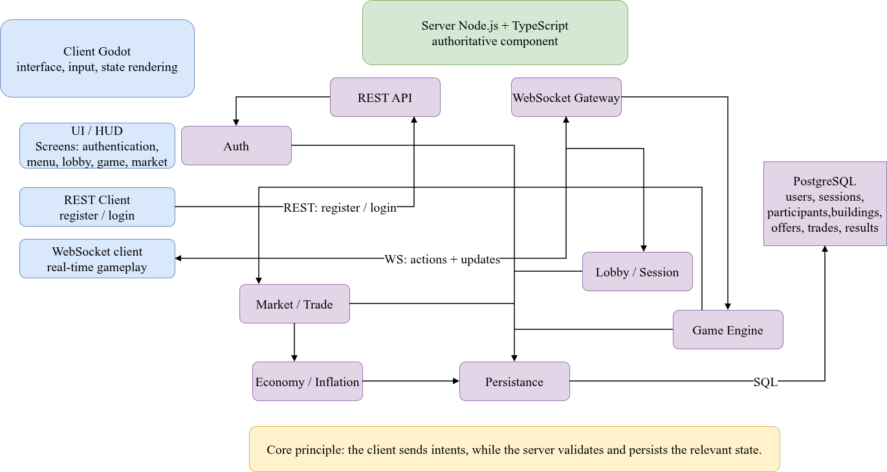

# Technical Overview

[← Back to the documentation hub](./README.md)

## Architecture

No-go Inflation uses an authoritative client-server model.

- The **Godot client** renders the interface, captures player input, and presents state received from the server.
- The **Node.js / TypeScript server** authenticates users, validates gameplay actions, owns active session state, and synchronizes players through WebSockets.
- **PostgreSQL** persists users, sessions, maps, buildings, resources, market offers, trades, and final results.

The client uses REST for registration and login, then uses WebSockets for lobby events, gameplay actions, market operations, and state updates.



## Authoritative gameplay

The client sends intents, not trusted state changes. Before applying an action, the server checks the authenticated player, the session state, ownership, available resources or currency, and the relevant game rules.

This applies to building, upgrades, collection, recycling, and market trades. This separation keeps multiplayer state consistent and prevents a client from directly changing the economy.

## Local-network play

The server can bind to `0.0.0.0` and reports available local IPv4 addresses at startup. The Godot client defaults to `localhost`; a player can enter and save a LAN server address from **Server Configuration**.

The selected address is used for both REST and WebSocket communication.

## Verification

The server has automated checks for formatting, linting, tests, and TypeScript compilation.

```bash
cd server
npm ci
npm run format:check
npm run lint
npm test
npm run build
```

The GitHub Actions workflow runs these checks for pull requests targeting `main`.
